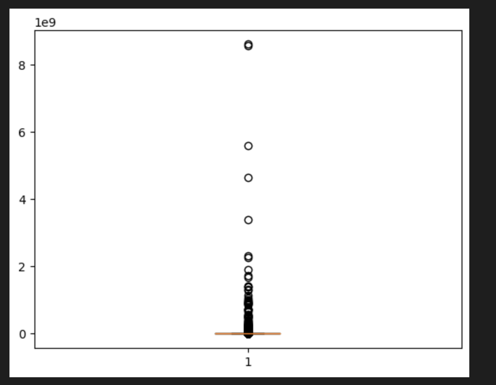
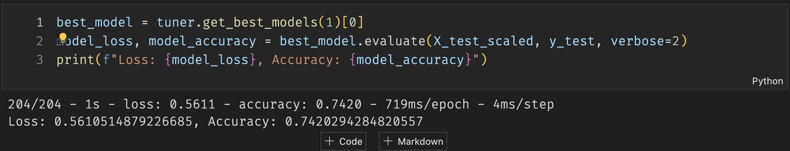

- [Neural Network Charity Analysis](#orgd86cee7)
  - [Overview](#org7d51335)
  - [Results](#org9fd3d16)
    - [Data Preprocessing](#orgbe2b6dd)
    - [Compiling, Training, and Evaluating the Model](#org1b83ff4)
  - [Summary](#orga228d5c)


<a id="orgd86cee7"></a>

# Neural Network Charity Analysis


<a id="org7d51335"></a>

## Overview

In this analysis we used Deep Learning for making predictions about the successful organizations that received funding from Alphabet Soup. We managed to create a fairly successful Neural Network model for creading predictions, however, the accuracy was not as high as desired but we gained enough insight in our data to keep iterating further.


<a id="org9fd3d16"></a>

## Results


<a id="orgbe2b6dd"></a>

### Data Preprocessing

-   We considered the &ldquo;IS<sub>SUCCESSFUL</sub>&rdquo; variable as our target as we only need a binary classification of our data.
-   We started using 43 variables as features as converting categorical data created a lot binary features, even after the binning.
-   However, we removed the identifier variables, like the &ldquo;NAME&rdquo; and &ldquo;EIN&rdquo; as they are not features in our dataset.


<a id="org1b83ff4"></a>

### Compiling, Training, and Evaluating the Model

-   We started with 80 neurons in our outer layer and 30 neurons in the hidden layer but we quickly moved to a lesser number of neurons when optimizing, specially when reducing the number of dimensions via PCA and removing outliers. The last model we tried manually had 2 inner layers with 10 neurons each and an outer layer with 40 neurons.
-   We didn&rsquo;t achieve the 75 percent accuracy target but we managed to rech to the following results:

```example
Loss: 0.5610514879226685,
Accuracy: 0.7420294284820557
```

This result was possibly by removing outliers, using PCA and the Keras Tuner.

-   The steps we used for optimizing the model were:

-   Get the outliers via: IQR, STD and K-Means clusters based on the &ldquo;ASK<sub>AMT</sub>&rdquo; (asked amount).
-   Train the first model with the new dataset without STD outliers.
-   We tried other hyperparameters like increaing the neurons in the inner layer and changing some activation functions as well as increasing the epoch.
-   We moved on to using Principal Component Analysis to reduce the number of dimensions.
-   With fewer dimensions, we reduced the number of neurons in each layer and we added a second inner layer.
-   However, this wasn&rsquo;t enough so we used Keras Tuner to find the &ldquo;best model&rdquo; which we also trained with 100 epochs.
-   Being still far from 75, we moved on to using the dataset without the IQR outliers, which consisted in about 20% less data.
-   We then applied the last manual model and the Keras Tuner to this new dataset and we got a result of `74.2%`.

Outliers:



Keras Tuner:




<a id="orga228d5c"></a>

## Summary

We weren&rsquo;t able to reach the 75% target accuracy but we managed to get pretty close after removing a lot of data from the dataset. This isn&rsquo;t ideal and we are probably better off separating the dataset depending on the &rsquo;ASK<sub>AMT</sub>&rsquo; value as the higher outliers are too far removed from the mean.

I think we should use a Dendogram to separate the dataset or even a binary tree classifier so we can determine which data is &ldquo;ask amount&rdquo; and which one is closer to the mean, we have enough data points to split the dataset and we can try more specialized models for each one after identifying the clusters.